# Artseek: a web application for intelligent search and discovery of visual artworks and artists 

## Index

- [1. Summary](#1-summary)
- [2. State of the Art](#2-state-of-the-art)
- [3. Screen Sketches](#3-screen-sketches)
- [4. Objectives](#4-objectives)
  - [Functional Objectives](#functional-objectives)
  - [Technical Objectives](#technical-objectives)
- [5. Methodology](#5-methodology)
  - [Phases](#phases)
  - [Dates](#dates)
  - [Gantt Chart](#gantt-chart)
- [6. Detailed Features](#6-detailed-features)
  - [Basic Functionality](#basic-functionality)
  - [Intermediate Functionality](#intermediate-functionality)
  - [Advanced Functionality](#advanced-functionality)
- [7. Analysis](#7-analysis)
  - [Screens and Navigation](#screens-and-navigation)
  - [Entities](#entities)
  - [User Permissions](#user-permissions)
  - [Images](#images)
  - [Charts](#charts)
  - [Complementary Technology](#complementary-technology)
  - [Advanced Algorithm or Query](#advanced-algorithm-or-query)
- [8. Progress Tracking](#8-progress-tracking)
- [9. Author](#9-author)
- [10. Use of AI Tools](#10-use-of-ai-tools)

---

## 1. Summary

Artseek will be a web application focused on the discovery of artworks and artists through intelligent searches based on natural language and reference images. Artists will be able to create a profile with a profile picture, a header image, and a portfolio of their works. Each artwork will include information provided by the artist and will be analyzed using Artificial Intelligence to extract characteristics that allow it to be categorized and represented semantically.

Clients will be able to describe the type of artwork they are looking for using natural language, provide reference images, or combine both methods. The system will analyze the query and retrieve the artworks with the highest similarity to it, also displaying the corresponding artists. Artists will also have access to the search system, allowing them to use Artseek to discover other artworks and artists.

The application is conceived as a discovery platform that combines textual and visual information to facilitate searches that would be difficult to express using traditional filters.

> **Current status:** only the functional and technical objectives, features, general analysis, navigation, and project planning have been defined. **Implementation of the application has not yet begun.** The designs and decisions described in this document represent the planned scope and may evolve during development.
---

## 2. State of the Art

To define the scope of Artseek, different applications and technologies related to artwork search, portfolio management, and information retrieval through visual and textual content will be studied.

The preliminary analysis includes the following references:

| Application or family | What it offers | Improvement or approach to be explored in Artseek |
| --- | --- | --- |
| [ArtStation]([https://www.artstation.com/](https://www.artstation.com/)) | Platform for portfolios and the discovery of artists and artworks. | Incorporate semantic and multimodal search based on the characteristics of the artworks. |
| [Behance]([https://www.behance.net/](https://www.behance.net/)) | Platform for showcasing portfolios and discovering creative work. | Enable searches based on natural-language descriptions and reference images. |
| [Pinterest]([https://www.pinterest.com/](https://www.pinterest.com/)) | Visual discovery through related images. | Combine visual similarity with textual information and data provided by the artist. |
| [Google Lens]([https://lens.google/](https://lens.google/)) | Search and recognition through images. | Apply visual search specifically to the domain of artworks and combine it with natural language. |
| Semantic search systems | Information retrieval using embeddings and vector similarity. | Apply semantic and multimodal search to a catalog of artworks. |

The study will make it possible to analyze how different platforms approach the discovery of artistic content and how traditional search systems can be complemented with Artificial Intelligence techniques.
Artseek proposes combining three main sources of information:

**artist description + visual content of the artwork + user query**.

The main differentiating factor will be the use of semantic representations of artworks to allow users to naturally **describe what they are looking for, without needing prior knowledge** of specific categories, tags, or artist names.

---

## 3. Screen Sketches

The first conceived screen was the Artist Portfolio one. A first approach was made free hand with paint. Then a higher prototype was self-made in Figma for this screen. This high level prototype consists the final result of the draft for the Artist Portfolio page and was the one later used for creating the rest of screens with Artificial Intelligence in an iterative manner (see more about this in [`AI_USAGE.md`](AI_USAGE.md])).

### First skecth of Artist Portfolio page:
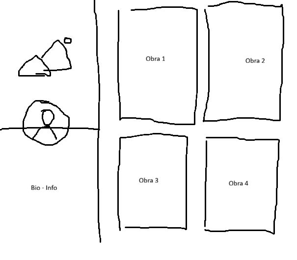

### Figma self-made Artist Portfolio screen:
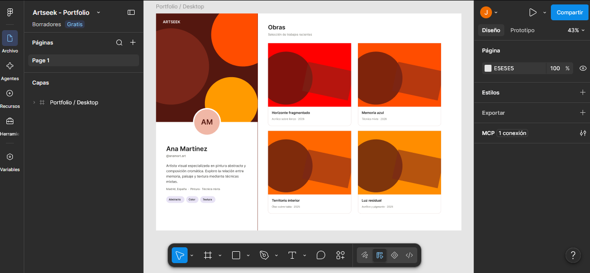
---

## 4. Objectives

### Functional objectives

The main functional objective of Artseek is to provide a platform that facilitates the discovery of artworks and artists through intelligent searches. To achieve this, users will be able to use natural language, reference images, or both sources of information simultaneously. Artists will be able to manage their profiles and portfolios, while Artificial Intelligence will make it possible to analyze and categorize their works in order to improve their subsequent retrieval.

The main functional objectives are:

- Allow users to register, log in, and manage their profile.

- Allow artists to create and manage a portfolio of artworks.

- Allow images, titles, and descriptions to be associated with artworks.

- Analyze artworks using Artificial Intelligence to obtain characteristics and categories.

- Allow users to search for artworks using queries written in natural language.

- Allow users to search for artworks using reference images.

- Allow natural language and images to be combined in the same search.

- Display results ordered according to their degree of similarity to the query.

- Allow users to search for artists directly.

- Display the relationship between the artworks found and the artists who created them.


### Technical objectives

The technical objective is to build a maintainable and scalable SPA web application that clearly separates the user interface, business logic, persistence, and Artificial Intelligence services. The system will use a REST API developed with Java and Spring Boot and a frontend developed with React. The application will run using Docker containers and will include continuous integration through GitHub Actions.

The main technical objectives are:

- Develop the interface as an SPA using **React**, **Vite** and **React Router**. Using **Tailwind CSS** and libraries such as **React Flow**, **Lucide React**, **Motion for React**

- Implement the backend using **Java and Spring Boot** through a REST API.

- Use a relational **PostgresSQL** database to store users, artists, artworks, and categories.

- Incorporate a storage system for vector representations to perform semantic searches.

- Integrate Artificial Intelligence services or models to analyze images and generate semantic representations.

- Implement vector search based on similarity between embeddings.

- Design the search system to support text, images, and multimodal queries.

- Use **Docker** for containerizing the different components of the application.

- Use **GitHub Actions** to automate compilation, testing, and quality checks.

- Apply an automated testing strategy during development, using **JUnit** and **Spring Boot Test**.

- Ensure authentication and authorization, as well as role-based access control and resource ownership control with **Spring Security** and **JWT**.


---

## 5. Methodology
The work will be carried out following an iterative and incremental methodology. First, the functional and technical scope of the application will be defined and, subsequently, the development environment and the necessary tools will be configured.

The functionalities will be implemented progressively across several iterations. Each iteration will incorporate new capabilities on top of the previous version and will end with a functional version of the application.

Phase 1 corresponds to the definition of the functionalities and the initial analysis. Phase 2 will be dedicated to configuring the development technologies and tools, together with the quality controls that will be run periodically.

Phases 3, 4 and 5 will be dedicated to the iterative and incremental development of Artseek. At the end of each of these phases, a new version (**release**) will be published.

Phase 6 will be dedicated to writing the Bachelor's Degree Final Project report, and Phase 7 to preparing the presentation and defense.


### Phases

| Phase | Description | Expected outcome |
| --- | --- | --- |
| 1 | Definition of functionalities | Functionalities, state of the art, screens, analysis, and README. |
| 2 | Configuration of technologies and tools | Prepared repository, development environment, initial tests, and quality controls. |
| 3 | Iterative and incremental development | Release of a first version with the basic functionality. |
| 4 | Iterative and incremental development | Release of a second version with the intermediate functionality and the first AI integration. |
| 5 | Iterative and incremental development | Release of the final version with the advanced functionality and multimodal search. |
| 6 | Report writing | Final Bachelor's Degree Final Project report. |
| 7 | Presentation preparation | Presentation and defense of the project. |


### Dates

The dates will be agreed upon with the supervisor and updated as the project progresses. The latest version, including the advanced and multimodal search algorithm, is planned for January, so that the Bachelor's Degree Final Project focused on deploying the same application can begin at that point.

| Phase | Proposed start | Proposed end |
| --- | --- | --- |
| Phase 1 | `[1/09/2026]` | `[25/09/2026]` |
| Phase 2 | `[26/09/2026]` | `[19/10/2026]` |
| Phase 3 | `[20/10/2026]` | `[30/11/2026]` |
| Phase 4 | `[01/12/2026]` | `[31/12/2026]` |
| Phase 5 | `[01/01/2027]` | `[31/01/2027]` |
| Phase 6 | `[01/02/2027]` | `[15/05/2027]` |
| Phase 7 | `[16/05/2027]` | `[15/06/2027]` |
| Fase 7 | `[16/05/2027]` | `[15/06/2027]` |

### Gantt Chart

Once the final dates have been defined, the different phases will be represented using a Gantt chart.

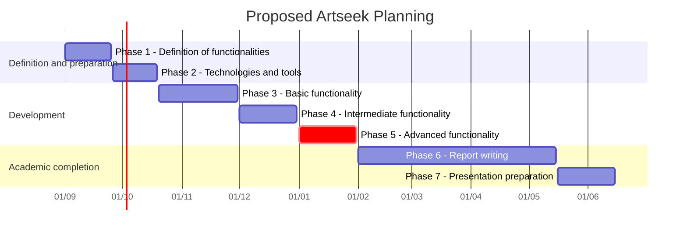
```mermaid
gantt

        title Proposed Artseek Planning
        dateFormat YYYY-MM-DD
        axisFormat %d/%m
        section Definition and preparation

        Phase 1 - Definition of functionalities :f1, 2026-09-01, 2026-09-25
        Phase 2 - Technologies and tools        :f2, 2026-09-26, 2026-10-19
        section Development
        Phase 3 - Basic functionality           :f3, 2026-10-20, 2026-11-30
        Phase 4 - Intermediate functionality    :f4, 2026-12-01, 2026-12-31
        Phase 5 - Advanced functionality        :crit, f5, 2027-01-01, 2027-01-31
        section Academic completion
        Phase 6 - Report writing                :f6, 2027-02-01, 2027-05-15
        Phase 7 - Presentation preparation      :f7, 2027-05-16, 2027-06-15
```

> **Note:** The dates shown in the diagram are provisional and must be replaced with the actual dates agreed upon for the project.


---

## 6. Detailed functionalities

Artseek's functionalities are grouped into three levels according to their priority and complexity:

- **Basic:** functionalities required to have a first operational version of the application.

- **Intermediate:** functionalities that expand artwork management and allow more comprehensive searches.

- **Advanced:** functionalities related to Artificial Intelligence, semantic search, and multimodal search.

Each functionality indicates the type of user it is intended for.


### Basic functionality

| Functionality | User type | Description |
| --- | --- | --- |
| Registration | Anonymous user | Create an account in the application. 
| Registration | Registered user | Log in and log out of the application. |
| Profile management | Registered user | View and modify profile information, including profile picture and header image. |
| Artist profile | Registered user | Manage the artist's public information and portfolio. |
| Artwork creation | Registered user | Create an artwork by providing a title, description, and images. |
| Artwork editing | Registered user | Modify the information of their own artworks. |
| Artwork deletion | Registered user | Delete artworks belonging to their own portfolio. |
| Artwork viewing | Anonymous user | View published artworks and access their information. |
| Artist viewing | Anonymous user | View artists' public profiles. |


### Intermediate functionality

| Functionality | User type | Description |
| --- | --- | --- |
| Artist search | Anonymous user | Search for artists by their name or username. |
| Artwork search by discipline | Anonymous user | Search and filter artworks available on the platform by discipline. |
| Artwork categorization | Registered user | Associate categories and characteristics with artworks. |
| Artwork analysis | Registered user | Automatically analyze an artwork using Artificial Intelligence when an artist uploads it. |
| User management | Administrator | View and manage users registered on the platform, including clients and artists. |
| Content moderation | Administrator | Review and manage published profiles and artworks when necessary to maintain the platform's content. |
| Platform administration | Administrator | Access the application's management functionalities and perform the operations available to other user types when necessary. |


### Advanced functionality

| Functionality | User type | Description |
| --- | --- | --- |
| Intelligent search using natural language | Registered user | Search for artworks by freely describing, in natural language, the characteristics, style, theme, feelings, or concepts to be found, without relying solely on filters or exact keywords. |
| Visual similarity search | Registered user | Provide a reference image to find artworks that are visually related to it through the analysis of their visual characteristics. |
| Multimodal search | Registered user | Combine a textual description and a reference image in the same query to retrieve artworks while taking both types of information into account simultaneously. |
| Intelligent artwork retrieval and ranking | System | Represent queries and artworks using semantic and visual information, calculate their similarity, and rank the results according to their relevance to the search performed. |
| Intelligent artist discovery | Registered user | Find artists whose portfolios have a high degree of affinity with a search by aggregating the relevance of the artworks belonging to each artist. |


---

## 7. Analysis

### Screens and navigation

Artseek's navigation will be organized around three main functionalities:

1. Profile and portfolio management.
2. Discovery of artists and artworks.
3. Intelligent search using text and images.

The main planned screens are:

| Screen | User type | Description | Accessible pages |
| --- | --- | --- | --- |
| Home/Landing | Anonymous user | Artseek's main page and entry point to search. | Search, artists, registration, login, and profile. |
| Registration | Anonymous user | Creation of a new account. | Login and home. |
| Login | Anonymous user | User authentication. | Registration and home. |
| Intelligent search | Registered user | Allows users to enter text, reference images, or both. | Results, home. |
| Intelligent search results | Registered user | Displays artworks and artists ordered by relevance. | Artwork details and artist profile. |
| Artist search | Anonymous user | Allows users to locate artists directly. | Artist profile. |
| Artist profile | Anonymous user | Displays the artist's public information and portfolio. | Artwork details. |
| Artwork details | Anonymous user | Displays an artwork, its information, and the artist who created it. | Artist profile and search results. |
| Own profile | Registered user | Allows users to view their account information. | Profile editing and, for artists, portfolio. |
| Profile editing | Registered user | Allows users to modify their profile information. | Own profile. |
| Artwork creation | Registered user | Form for publishing a new artwork. | Profile, portfolio, and artwork details. |
| Artwork editing | Registered user | Modification of an existing artwork. | Profile and artwork details. |

### Application Screens Drafts

#### Home/Landing

Introduces and provides entry points for exploring creative disciplines.

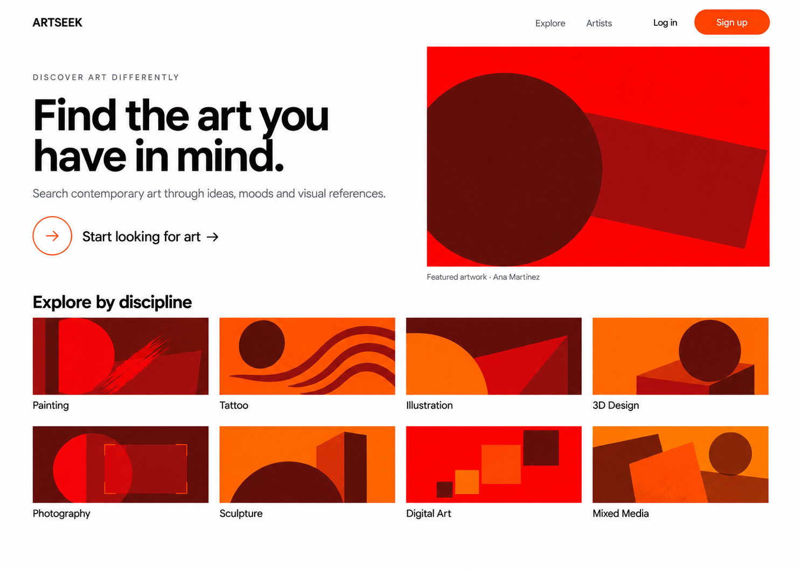

#### Intelligent Search

Allows users to search for artwork using text, a reference image, or both.

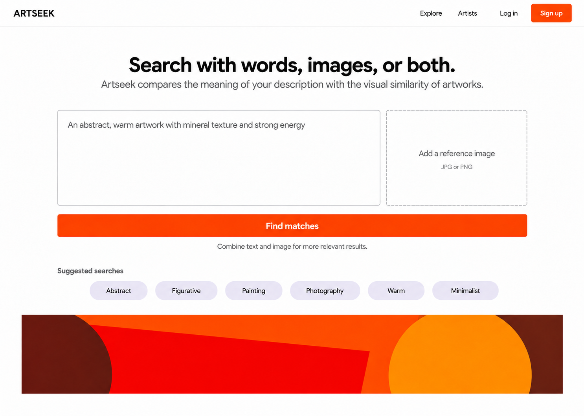

#### INtelligent Search Results

Displays artworks ranked by their affinity with the user’s search.

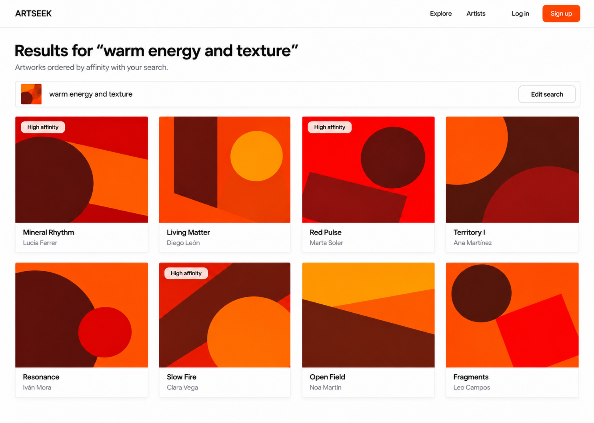

#### Artist Search

Combines artist search controls and matching artist profiles on one page.

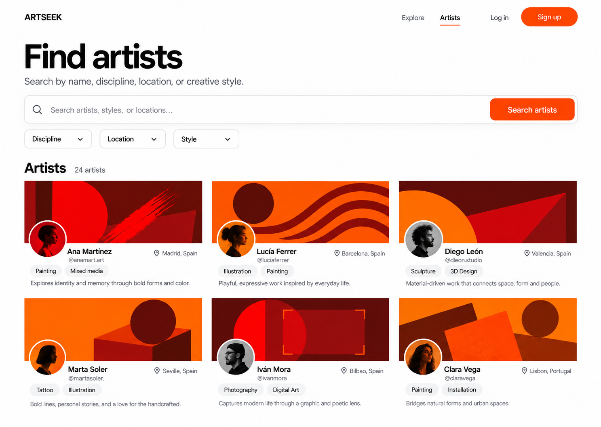

#### Artist Profile

Shows an artist’s public information and portfolio.

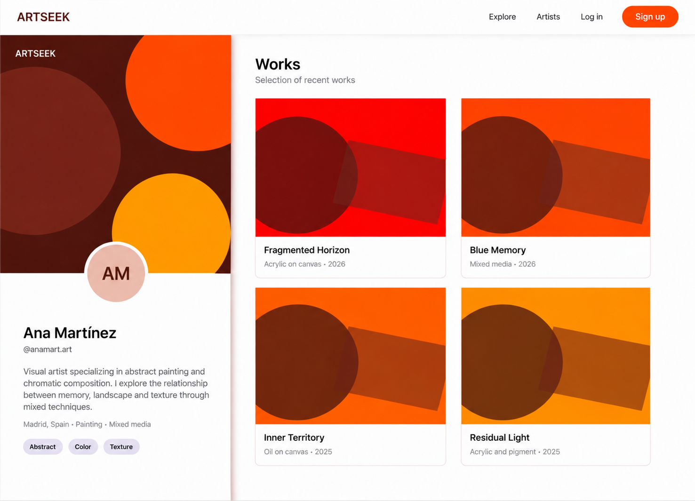

#### Client Profile

Shows a client profile with an option to activate an artist portfolio.

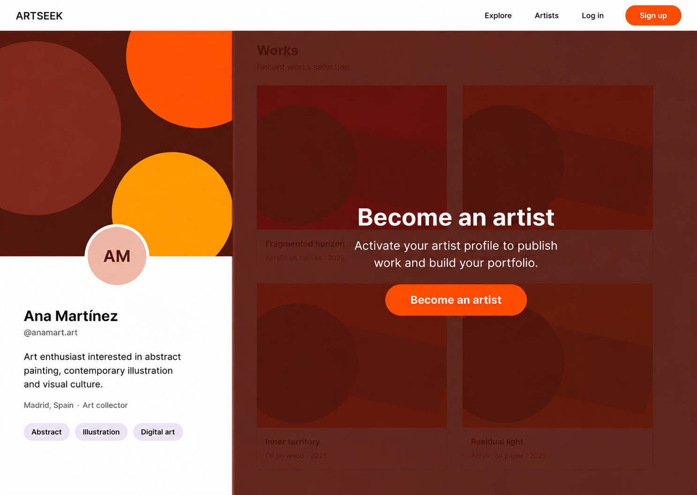

#### Artwork Focus

Presents an enlarged artwork preview within the artist’s portfolio.

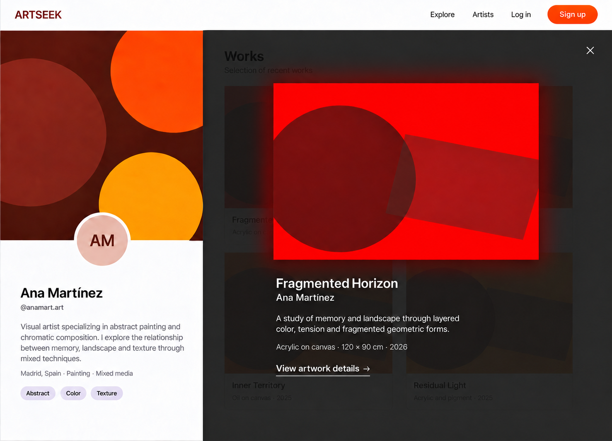

#### Artwork Detail

Provides a dedicated view of an artwork, including its description, characteristics, categories, and AI analysis.

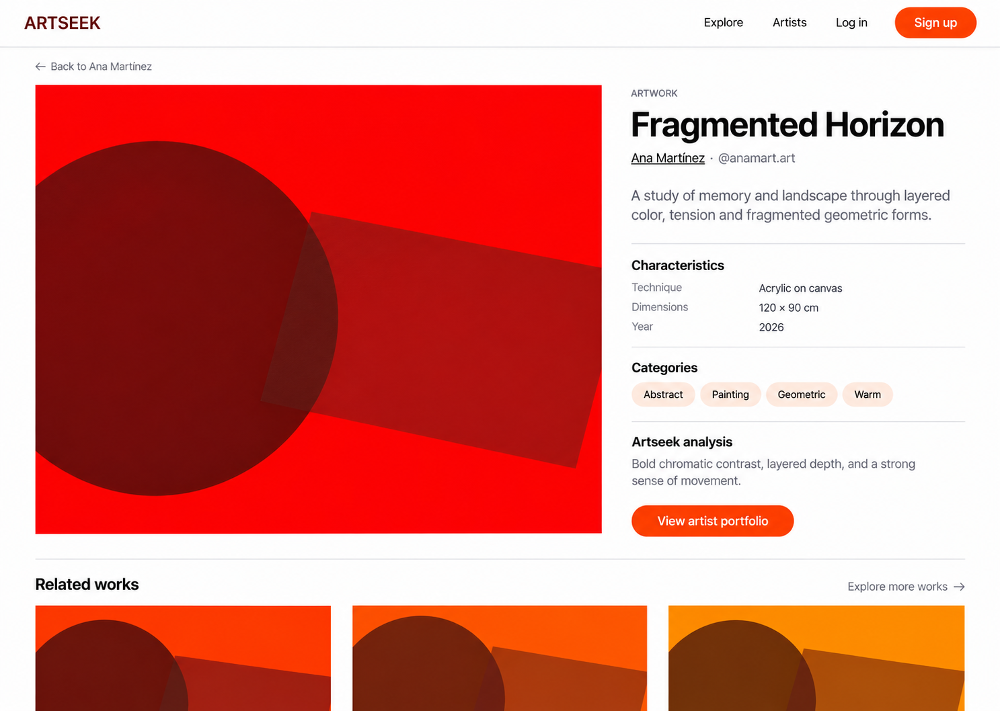

#### Owner Artwork Detail

Shows the artwork detail view with editing controls available to its owner.


#### Edit Artwork

Allows the owner to update artwork information while keeping AI-generated analysis read-only.

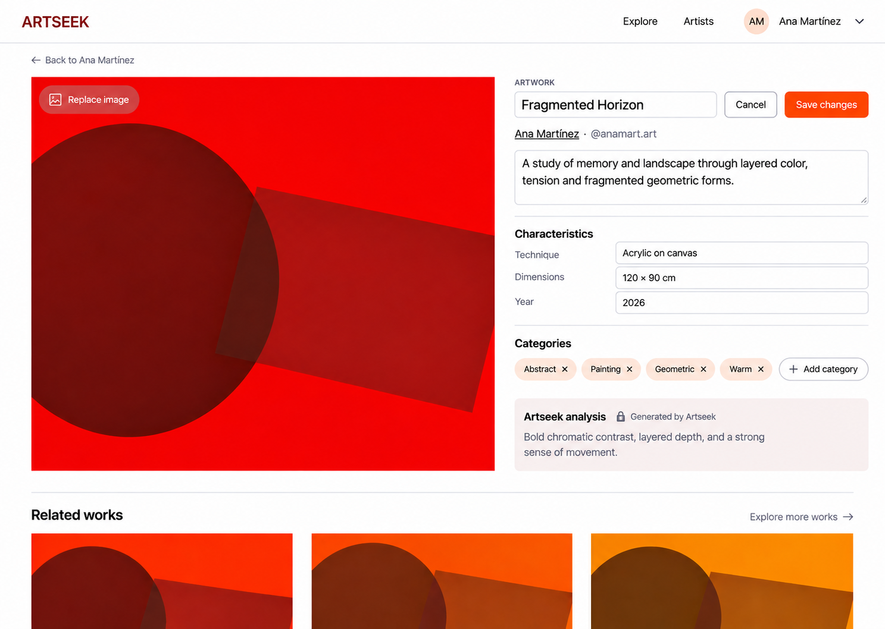

#### Account Details

Displays the signed-in user’s personal and account information.

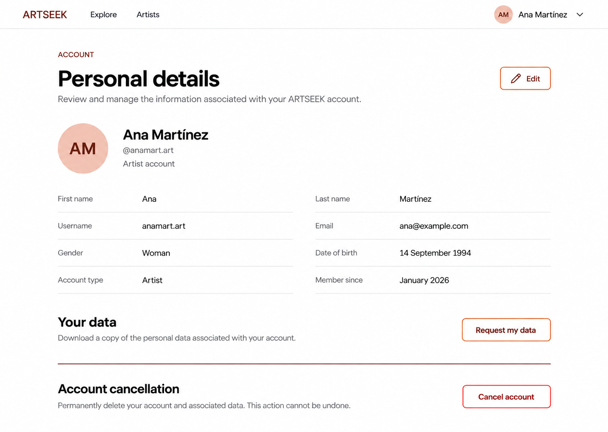

#### Edit Account Details

Allows users to update their personal information and profile image.

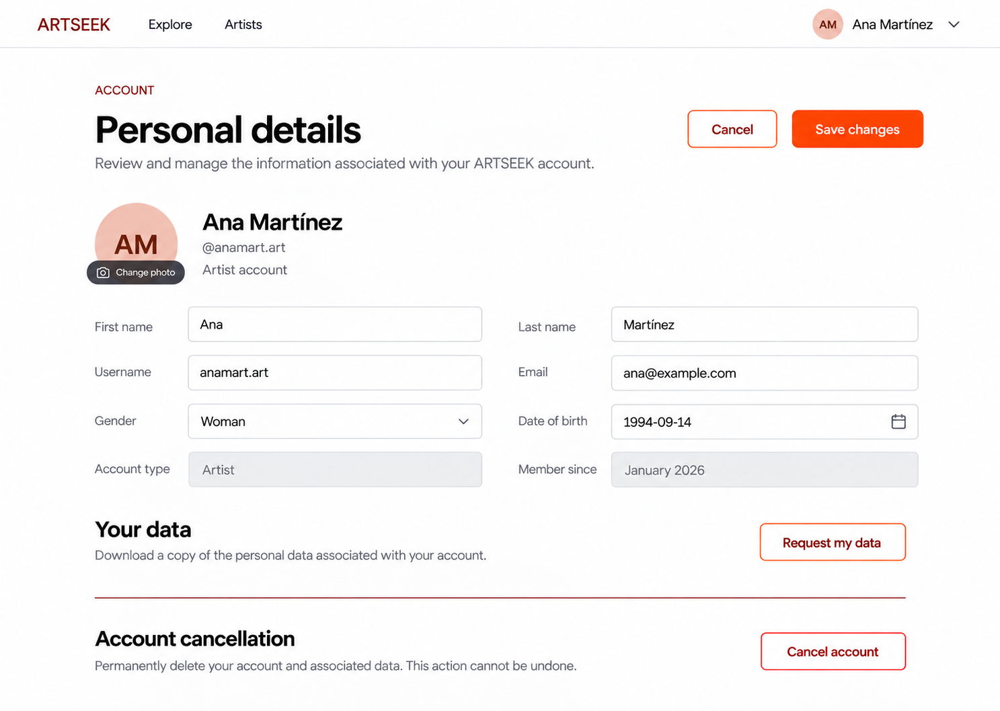

#### Log In

Provides a focused authentication form for returning users.

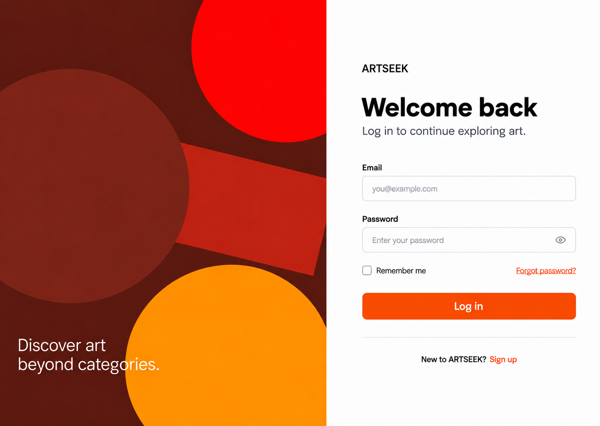

#### Sign Up

Collects the information required to create a client or artist account.

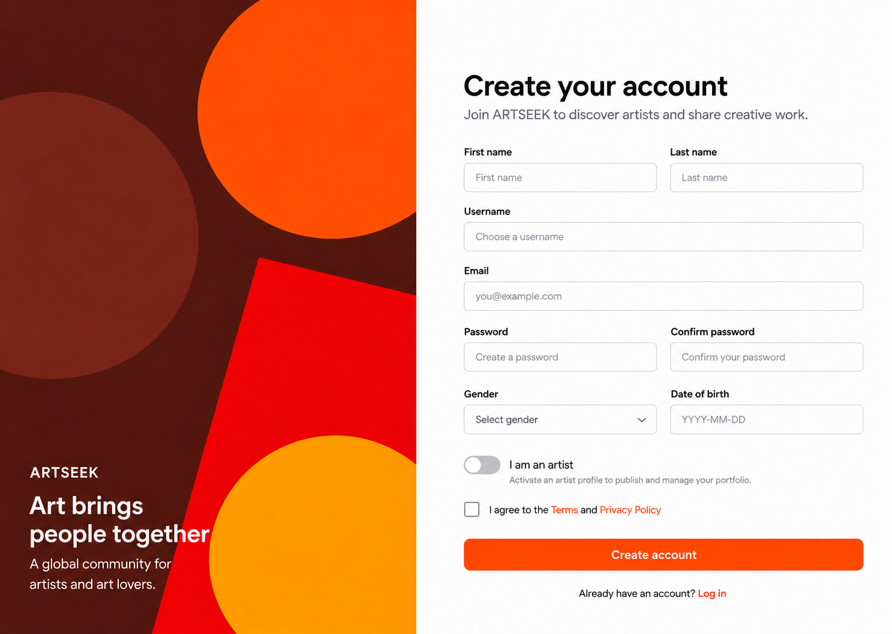

#### Navigation Diagram

Arrow colors indicate the minimum role required for each transition. Administrators inherit the transitions available to anonymous and registered users; dashed red arrows identify administrator-only moderation overrides.

[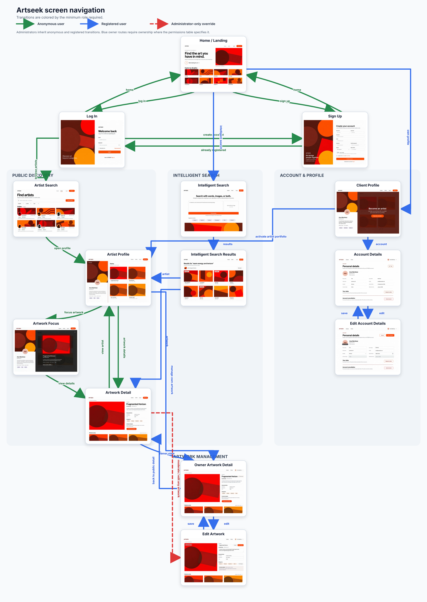](docs/navigation-diagram.svg)


---

### Entities

The main Entities in Artseek domain are the following:


```mermaid
classDiagram

    class User {
        +Long id
        +String username
        +String email
        +String passwordHash
        +String displayName
        +String bio
        +String profileImage
        +String headerImage
        +Boolean isArtist
        +LocalDateTime createdAt
        +LocalDateTime updatedAt
    }

    class Portfolio {
        +Long id
        +String title
        +String description
        +Boolean isPublic
        +String layoutPreference
    }

    class Artwork {
        +Long id
        +String title
        +String description
        +LocalDateTime createdAt
        +LocalDateTime updatedAt
    }

    class Category {
        +Long id
        +String name
        +String type
    }

    class SearchQuery {
        +Long id
        +String naturalLanguageText
        +String referenceImageUrl
        +SearchType searchType
        +LocalDateTime executedAt
    }

    class SearchType {
        <<Enumeration>>
        TEXT
        VISUAL
        MULTIMODAL
    }

    class AIAnalysis {
        <<Value Object>>
        +String description
        +String characteristics
        +String model
        +LocalDateTime analyzedAt
    }

    class Embedding {
        <<Value Object>>
        +String type
        +String model
        +Vector vector
        +LocalDateTime generatedAt
    }

    User "1" --> "0..1" Portfolio : owns
    Portfolio "1" --> "0..*" Artwork : contains
    User "1" --> "0..*" SearchQuery : executes
    Artwork "0..*" --> "0..*" Category : belongs to
    

    SearchQuery *--"1..1"SearchType
    Artwork *-- "0..1" AIAnalysis : contains
    Artwork *-- "0..*" Embedding : contains
 ```

Entities in Artseek represent objects with a distinct identity that persists over time, even if their attributes change.

**User**: This is the primary actor in the system. A user has a unique identity, personal information (such as username, email, and display name), and profile customization data (profile and header images). Users can be either clients or artists, distinguished by the isArtist flag.

**Portfolio**: This entity serves as a container for an artist's creative output. Instead of artworks being directly attached to a user, they are grouped within a portfolio. This allows the artist to manage the collection as a whole (e.g., setting the entire portfolio as public or private, or defining layout preferences). Furthermore, this design is built with scalability in mind: while an artist currently manages a single portfolio, this structure easily supports a future feature where an artist could create multiple distinct portfolios to separate different collections (e.g., "Digital Art" vs. "Traditional Painting").

**Artwork**: The core content entity of the platform. It represents a single creative piece, holding its own identity, title, description, and timestamps.

**Category**: Categories are used to classify artworks (e.g., disciplines, techniques, or styles). A category is an entity because it has a shared, independent lifecycle; an administrator can create, rename, or delete a category globally, and these changes must be reflected across all artworks that reference it.

**SearchQuery**: To leverage the intelligent nature of the platform, user searches are modeled as persistent entities rather than ephemeral actions. A SearchQuery records the specific input from the user (the natural language text and/or the URL of a reference image), the type of search executed (defined by the SearchType enumeration: textual, visual, or multimodal), and the exact timestamp. This allows the platform to offer users a history of their past searches and provides valuable analytical data to calibrate and improve the semantic search algorithm over time.

#### Value Objects
Unlike Entities, Value Objects are defined entirely by their attributes and do not possess a unique identifier. They are immutable descriptions that only make sense within the context of the entity that owns them.

**AIAnalysis**: When an artwork is uploaded, the Artificial Intelligence model generates a description and extracts characteristics. This result is a Value Object. It has no independent existence; it is simply a descriptive trait embedded within the Artwork. If the artwork is re-analyzed, the old analysis is entirely replaced by the new one.

**Embedding**: This represents the mathematical, semantic vector generated from the artwork's visual or textual data. Like the AI analysis, an embedding is just a complex attribute of the Artwork used for similarity calculations. It is bound to the artwork via strict composition.

---


### User permissions

Initially, three main types of users are considered:

- **Anonymous user**: user not registered in the application

- **Registered user**: user registered in the application. They may be a client or an artist.

- **Administrator**: administrator user


| Action | Anonymous user | Registered user | Administrator |
| --- | :---: | :---: | :---: |
| View public content | Yes | Yes | Yes |
| Register | Yes | — | — |
| Log in | Yes | Yes | Yes |
| Manage own profile | No | Yes | Yes |
| View profiles | Yes | Yes | Yes |
| Search for artists | Yes | Yes | Yes |
| Access artwork details | Yes | Yes | Yes |
| Perform searches using text | No | Yes | Yes |
| Perform searches using images | No | Yes | Yes |
| Perform multimodal searches | No | Yes | Yes |
| Activate artist profile | No | Yes | — |
| Create artworks | No | Only if they are an artist | Yes |
| Modify own artworks | No | Only if they are an artist and the owner | Yes |
| Delete own artworks | No | Only if they are an artist and the owner | Yes |
| Manage portfolio | No | Only if they are an artist and the owner | Yes |
| View AI analysis | Yes | Yes | Yes |
| Manage own categories | No | Only if they are an artist and the owner | Yes |

---

### Images

Artseek will use images associated with different entities and functionalities.

The main ones will be:

- User profile image.
- Profile header image.
- Images of the artworks.
- Reference images used during searches.

| Entity / functionality | Images | Use |
| --- | --- | --- |
| User | One profile image | Visual identification of the user. |
| User | One header image | Profile customization. |
| Artwork | One or more images | Visual representation of the artwork. |
| Search | One reference image | Input for visual or multimodal searches. |

Artwork images must be usable as part of the process of generating semantic representations and similarity-based search.

---

### Charts

Charts do not constitute a main functionality of Artseek, since the primary purpose of the application is the discovery of artworks and artists.

However, charts could be incorporated to display information related to portfolios or the operation of the system.

Some possibilities are:

- **Bar chart:** number of artworks per category within a portfolio.

- **Pie chart:** distribution of a portfolio according to styles or techniques.

- **Line chart:** evolution over time of published artworks or interactions with the portfolio.

These functionalities will have a secondary priority and will only be implemented if they are relevant to the final scope of the project.

---

### Complementary technology

The complementary technology will be mainly related to Artificial Intelligence and semantic search.

The selection will take into account for the AI model:

- Ability to analyze images.
- Ability to work with text.
- Possibility of obtaining embeddings.
- Compatibility with multimodal searches.
- Quality of the results.
- Cost.
- Performance.
- Ease of integration.
- License and terms of use.

The planned technology architecture is:

| Technology | Use |
| --- | --- |
| PostgreSQL | Persistence of the application's entities. |
| pgvector | Storage and search of vector representations. |
| Docker | Containerization of the application. |
| Docker Compose | Orchestration of the local development environment. |
| Spring Security | Authentication and authorization. |
| JWT | Authentication management using tokens. |
| GitHub Actions | Continuous integration and quality controls. |
| AI service/model | Image analysis and generation of semantic information. |

The specific technology used for the Artificial Intelligence models will be selected during the technical analysis phase.

---

### Advanced algorithm or query

The most relevant technical functionality of Artseek will be a **multimodal semantic search system based on embeddings**.

Each artwork will have an associated semantic representation obtained from the information available about it.

Conceptually:

```text
                         ARTWORK
                           │
             ┌─────────────┴─────────────┐
             │                           │
        Textual Data                   Image
         Artist + AI                     │
             │                           │
             ▼                           ▼
      Textual Embedding            Visual Embedding
             │                           │
             └─────────────┬─────────────┘
                           │
                           ▼
                    Artwork semantic
                     representation     
                           │
                           ▼
                   Vectorial database
```

A natural language query will follow a similar process:

```text
   User query
        │
        ▼
  Text processing
        │
        ▼
  Query embedding
        │
        ▼
 Similarity search
        │
        ▼
 Candidate artworks
        │
        ▼
 Ranking by relevance
        │
        ▼
      Results
```

In an image-based search:

```text
  Reference image
        │
        ▼
  Image analysis
        │
        ▼
  Visual embedding
        │
        ▼
  Similarity search
        │
        ▼
  Candidate artworks
        │
        ▼
 Ranking by relevance
        │
        ▼
     Results
```

In a multimodad search both sources will be combined

```text
                      Query
                   /        \
                  /          \
               Text          Image
                 │              │
                 ▼              ▼
            Textual          Visual
           Embedding        Embedding
                 │              │
                 └──────┬───────┘
                        ▼
                  Query semantic 
                  representation
                        │
                        ▼
                 Vectorial search
                        │
                        ▼
                     Ranking
                        │
                        ▼
                     Results
```


A first approach to calculating relevance will be to combine textual and visual similarity using a weighted function:

```text
score =
    α × textualSimilarity +
    β × visualSimilarity
```

where `α` and `β` represent the relative weight of each component.

These weights will be determined experimentally during development.

The similarity between vector representations may be calculated using **cosine similarity**:

```text
cos(A, B) = (A · B) / (||A|| × ||B||)
```

The search should initially retrieve a set of candidate artworks and subsequently rank them according to the score obtained.

The objective will be for the top positions to correspond to the artworks with the highest semantic and visual similarity to the query performed.

During development, the quality of the results will be evaluated using different types of queries and sets of artworks to assess the behavior of the system.

---

## 8. Tracking

Project tracking will be carried out using a **GitHub Project**, where the tasks corresponding to each phase will be managed.

Tasks will be organized using statuses similar to:

```text
Backlog → To do → In progress → Review → Completed
```

The following will be used:

- **Issues** to describe tasks, functionalities, bugs, and improvements.
- **Pull Requests** to integrate changes.
- **Releases** to publish the versions corresponding to Phases 3, 4, and 5.
- Documentation: a [`CHANGELOG.md`](CHANGELOG.md) file will be ketp in the root project tracking all the changes

Functionalities will be identified using codes such as `F-01`, `F-02`, etc., making it possible to link the requirements defined in this document with the implementation tasks.

---

## 9. Author

The development of Artseek is being carried out in the context of the Bachelor's Degree Final Project (TFG) of the Double Degree in Computer Engineering and Software Engineering (GII + GIS) at the School of Computer Engineering (ETSII) of Rey Juan Carlos University (URJC).

- **Student:** `Jaime Torroba Martínez`

- **Supervisor:** `Óscar Soto Sánchez`

---

## 10. Use of AI tools

During the project definition phase, Artificial Intelligence tools have been used to support research, analysis, and documentation writing.

In particular, **OpenAI Codex** has been used as a support tool to:

- Research concepts related to semantic and multimodal search.
- Analyze potential application functionalities.
- Organize and structure requirements.
- Propose architecture and technology alternatives.
- Review the definition of entities and relationships.
- Create and review the initial project documentation.

The final decisions regarding the objectives, scope, functionalities, architecture, and technologies are the responsibility of the student and will be reviewed throughout the different phases of the Bachelor's Degree Final Project.

The use of Artificial Intelligence tools as part of the development of Artseek will be documented throughout the project, distinguishing between work carried out directly by the student and work performed with the assistance of these tools, and will be recorded in the [`AI_USAGE.md`](AI_USAGE.md) file at the root of the project.
